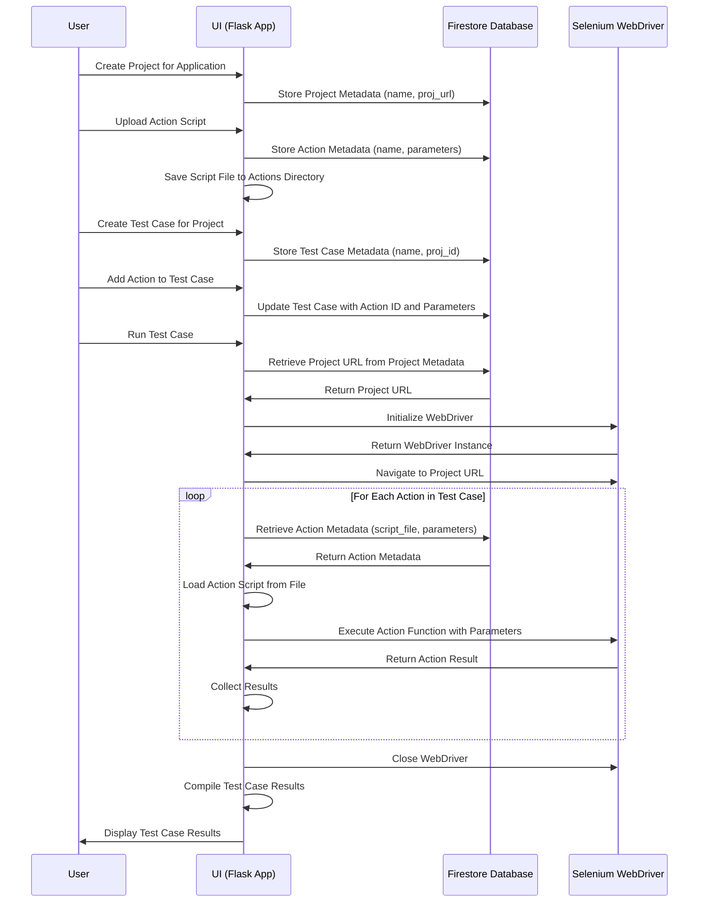

# TestOps Dashboard

TestOps Dashboard is an innovative automated testing framework designed to streamline UI testing processes. It leverages Selenium for automation, Firebase for data management, and AI-driven script generation via the Gemini API. The framework introduces a modular approach to test case creation through reusable "actions," detailed element coverage reporting, and project-wide insights with interactive visualizations.

## Key Features

- **AI-Powered Test Script Generation:** Utilize a Gemini API-powered chatbot to generate Selenium action scripts, accelerating test creation.
- **Reusable Test Actions:** Construct test cases using modular actions (e.g., `fill_username`, `click_button`), enhancing maintainability and reducing redundancy.
- **Comprehensive Element Coverage:** Track interactions with UI elements (buttons, inputs, links) and visualize coverage through bar charts at both test case and project levels.
- **Project-Wide Reporting:** Aggregate test data across all test cases and URLs, providing summary statistics and insights for informed decision-making.
- **User-Friendly Interface:** Manage projects, test cases, and actions via an intuitive Flask-based web dashboard styled with Tailwind CSS.

## Tech Stack

- **Backend:** Flask, Python, Firebase (Firestore)
- **Testing:** Selenium, WebDriver Manager
- **Frontend:** HTML, Tailwind CSS, Chart.js
- **AI Integration:** Gemini API

## Why This Project?

TestOps Dashboard addresses critical challenges in software testing by improving test coverage, reducing manual effort, and providing actionable insights. It is ideal for QA teams seeking to enhance their UI testing workflows with automation and detailed reporting.

## Getting Started

1. Clone the repository: `git clone <repo-url>`
2. Install dependencies: `pip install -r requirements.txt`
3. Set up Firebase credentials in `firebase_credentials.json`.
4. Run the app: `python app.py`
5. Access the dashboard at `http://localhost:5000`.

## Contributions

We welcome contributions! Check out the [issues](link-to-issues) page for tasks, or submit a pull request with your improvements.

## Directory Structure

```
TestOps-Dashboard/
├── actions/                    # Directory for reusable action scripts
│   ├── fill_username.py
│   ├── click_button.py
│   └── ...
├── templates/                  # HTML templates for the web dashboard
│   ├── projects.html
│   ├── testcases.html
│   ├── actions_view.html
│   └── ...
├── static/                     # Static files (CSS, JS, images)
│   ├── css/
│   ├── js/
│   └── ...
├── app.py                      # Main Flask application file
├── requirements.txt            # Python dependencies
├── firebase_credentials.json   # Firebase service account credentials
├── diagram.mmd                 # Mermaid sequence diagram
└── README.md                   # Project documentation
```

## Use Cases

1. **Creating a New Test Case:**
   - Users can create a new test case by providing a name and the project URL.
   - The test case is stored in Firebase, and users can manage associated actions.

2. **Generating Action Scripts with AI:**
   - Users can interact with the AI chatbot to generate Selenium action scripts.
   - The chatbot provides script suggestions based on user queries, enhancing productivity.

3. **Running Test Cases:**
   - Users can execute test cases, which run the associated actions in sequence.
   - Test results are stored in Firebase and can be viewed in real-time.

4. **Viewing Element Coverage Reports:**
   - Users can access detailed reports showing element interaction coverage for individual test cases and the entire project.
   - Reports include visualizations like bar charts for better insights.

## Sequence Diagram



This sequence diagram illustrates the interaction between the user, dashboard, AI chatbot, Selenium, and Firebase during the test case creation, script generation, execution, and reporting processes.

## Conclusion

TestOps Dashboard is a robust solution for modern UI testing, combining the power of AI-driven automation, modular test design, and detailed reporting to elevate software quality assurance. By providing reusable actions, comprehensive element coverage, and project-wide insights, it empowers QA teams to achieve higher test coverage with less effort. Whether you're a developer, tester, or project manager, TestOps Dashboard offers the tools to streamline your testing workflows and ensure reliable software delivery. Dive in, explore the features, and contribute to making testing smarter and more efficient!
